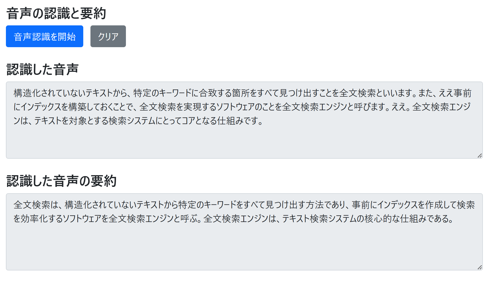

# リアルタイム音声認識＋要約のサンプルアプリ

## 使い方

[settings.json](./settings.json) の下記プロパティを設定します。
 -  ```OPENAI_NAME```: 使用する Azure OpenAI Service のアカウントの名前
 - ```OPENAI_KEY```: Azure OpenAI Service アカウントの認証キー
 - ```OPENAI_MODEL```: Azure OpenAI Service アカウントのモデルのデプロイメント名
 - ```SPEECH_SERVICE_REGION```: Azure Speech Service アカウントのリージョン名
 - ```SPEECH_SERVICE_KEY```: Azure Speech Service アカウントの認証キー

## ローカル環境での実行方法

以下のコマンドを実行して Python モジュールをインストールします。
```bash
pip install -r requirements.txt
```

以下の通りに [localrun.sh](./localrun.sh) を実行して、Web アプリケーションを起動します。
```bash
./localrun.sh
```

```http://127.0.0.1:5000``` を Web ブラウザで開くことで、アプリケーションを利用することができます。



## Azure へのデプロイ方法

以下の通りに [deploy.sh](./deploy.sh) を実行して、Web アプリケーションを Azure へデプロイします。第一引数にはデプロイ先のリソースグループ名を指定する必要があります。
```bash
./deploy.sh {デプロイ先のリソースグループ名}
# [例] ./deploy.sh rg-analyze-speech
```
